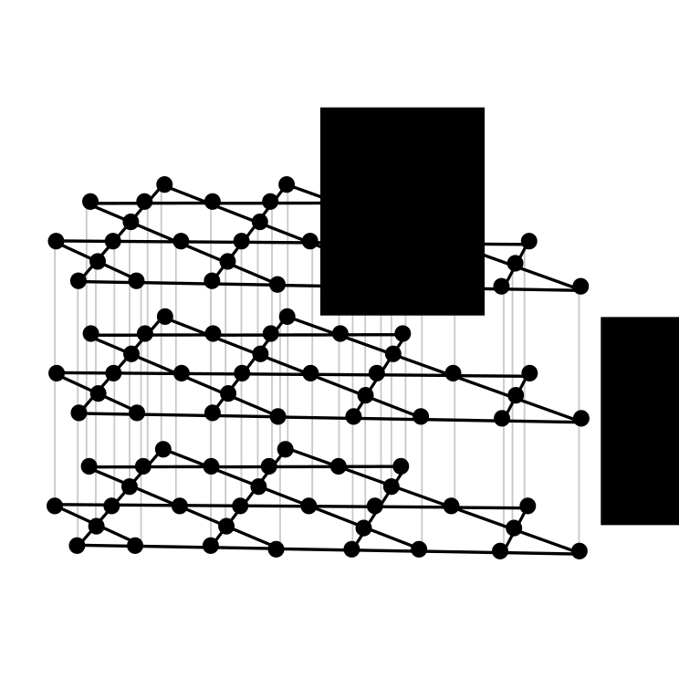

# Metropolis algorithm in CUDA GPGPU framework 

This is an implementation of Metropolis algorithm for stacked Ising model on kagome lattice. 

{width="40%"}

## Prerequisities 
 
- [CUDA](https://developer.nvidia.com/cuda-downloads) (obviously)
- [CUB](https://nvlabs.github.io/cub/) library

## Features
 
- Calculates energy and magnetizations
- Calculates and saves mean values of observables (if `CALCULATE_MEANS` macro is defined)
- Saves the final configuration of the lattice, if `SAVE_CONFIGURATION` macro is defined
- Saves time series of observables, if `SAVE_TS` macro is defined
- Random numbers are produced in batch for better performance
- Logic of Metropolis algorithm is separated from the lattice shape (contained in kernels)

## Ising model

$$
\mathcal{H} = -J_1\sum_{k=1}^N\sum_{<i,j>}\sigma_{i,k}\sigma_{j,k}-J_2\sum_{k=1}^N\sum_{<i,j>}\sigma_{i,k}\sigma_{i,k+1}-h\sum_{i,k}\sigma_{i,k},
$$
where the first sum goes over interacting pairs of spins within layers (only n.n.), the second sum goes over n.n. from neighboring layers and the last sum represents magnetization. Variables $J_1$ and $J_2$ represent intralayer and interlayer coupling constants, respectively, and $h$ is external magnetic field. In the simplest version of Ising model, variables $\sigma_{i,k}=\pm 1$.

## Metropolis algorithm

Metropolis algorithm (MA) is a Markov chain Monte Carlo method, which is widely used in statistical physics for obtaining a sequence of random samples from a given distribution. In each Metropolis trial a new state is proposed, it's energy is calculated and then it is either accepted or rejected with probability proportional to it's Boltzmann factor. The main idea behind MA is captured by this pseudocode:

```ruby
# Initialize the variable
sum_A = 0 

# N_trials steps are performed
for n in 1..N_trials
    # A new state is proposed
    X_new = X_old + dX
    
    # Energy change is calculated
    dH = H(X_new) - H(X_old)
    
    # Attempt to change the value
    if dH < 0
        X_old = X_new
    else if rand() < exp(-beta*dH)
        X_old = X_new
    else
        X_old = X_old
    end
    
    # Sum is updated
    sum_A += A(X_old)
end

# Final thermal average is calculated
avg_A = sum_A / N_trials
```

where $\beta = 1/(k_BT)$ is the inverse temperature, $k_B$ is Boltzmann constant and $T$ is the thermodynamic temperature.

Each Monte Carlo trial consists of an attempt to flip one spin from $\sigma_{i,k}$ to $-\sigma_{i,k}$, the energy change is therefore calculated as:
$$
d\mathcal{H} = 2\sigma_{i,k}\left(J_1\sum_{k=1}^N\sum_{<i,j>}\sigma_{j,k}-J_2\sum_{<i,j>}(\sigma_{i,k-1} + \sigma_{i,k+1}) -h\right)
$$

## Boltzmann factors

Since the spin variables $\sigma_{i,k}$ can take only two values $\pm 1$ and the number of n.n. is finite, we can construct a table for all possible values of $exp(-\beta d\mathcal{H})$ and store them in memory to save computational time. 

## TODO

- [x] Rewrite `generate_Boltzman_factors()` for 3D lattice
- [x] Rewrite `Lattice.h` to accomodate 6 sublattices and macros in `config.h`
- [x] Add macro for PBC
- [ ] Hook up PBC macro to some functionality
- [x] Rewrite `Quantities.h` to accomodate for 6 sublattices
- [x] Add TS for new sublattice magnetizations
- [x] Rewrite `updateX` kernels for 3D lattice
- [x] Add `updateX` for `X` = 4..6
- [x] Rewrite `init_lattice()`
- [x] Rewrite `energyCalculation` kernel
- [x] Fix offset for RNG
